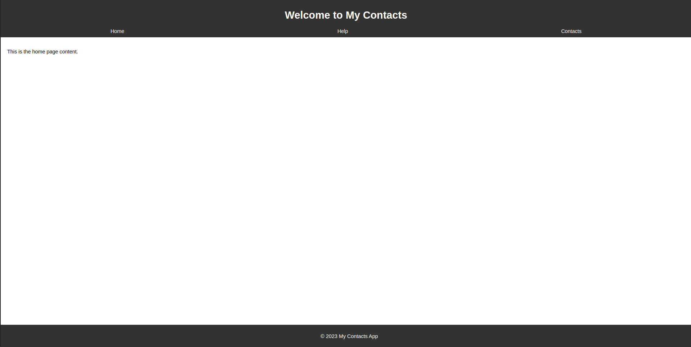
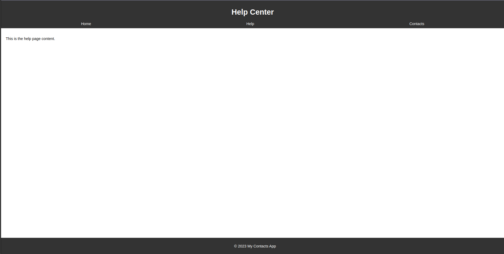
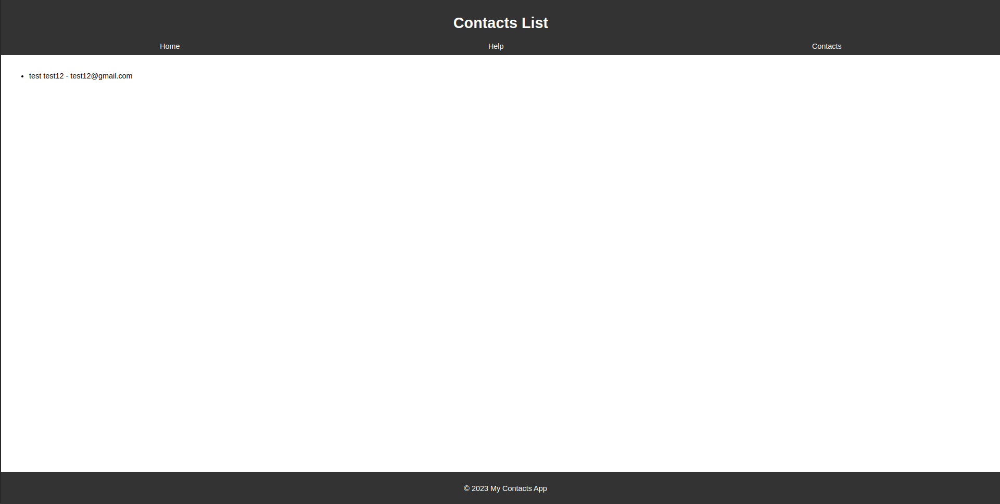
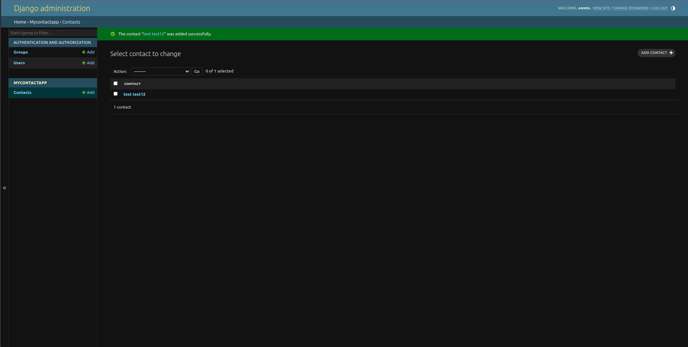

# My Contact App

## Overview

This Django-based Contact App allows users to manage and view their contacts. It includes features such as a homepage, help section, and a list of contacts.

## Installation

1. **Clone the Repository:**
   Clone the repository to your local machine.

   ```bash
   git clone https://github.com/your-username/mycontactproject.git
   cd mycontactproject
   ```

2. **Create a Virtual Environment:**
   Create a virtual environment to manage dependencies.

   ```bash
   python -m venv venv
   ```

3. **Activate the Virtual Environment:**
   Activate the virtual environment.

   - On Windows:

     ```bash
     venv\Scripts\activate
     ```

   - On macOS/Linux:

     ```bash
     source venv/bin/activate
     ```

4. **Install Dependencies:**
   Install project dependencies.

   ```bash
   pip install -r r.txt
   ```

5. **Run Migrations:**
   Apply database migrations.

   ```bash
   python manage.py migrate
   ```

6. **Create Superuser:**
   Create an admin superuser for accessing the admin interface.

   ```bash
   python manage.py createsuperuser
   ```

   Follow the prompts to create the superuser.

## Usage

### Run the Development Server

```bash
python manage.py runserver
```

Visit `http://127.0.0.1:8000/` in your browser to access the app.

### Admin Interface

Access the admin interface at `http://127.0.0.1:8000/admin/` and log in with the superuser credentials.

## Screenshots

Include screenshots of the homepage, help page, and contacts list to provide visual context.

### Homepage



### Help Page



### Contacts List



### Admin dashboard



## Contributing

Feel free to contribute to the development of this project by opening issues or submitting pull requests.

## License

This project is licensed under the MIT License - see the [LICENSE](LICENSE) file for details.
